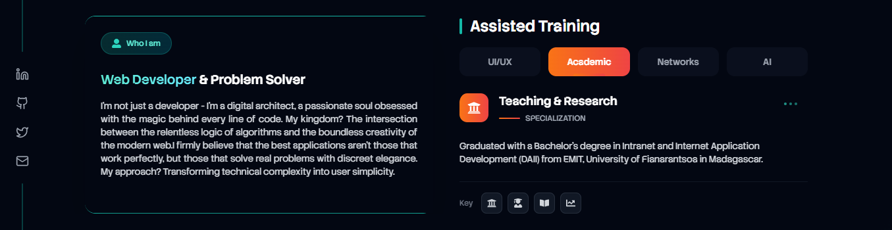

  
  
  

    <a href="https://steverasoafanirindraibe.vercel.app/">Portfolio</a> •
    <!-- <a href="www.linkedin.com/in/steve-rasoafanirindraibe-b8baa33a7">LinkedIn</a> • | change the right link -->
    <a href="mailto:steveshannyrasoafanirindraibe@gmail.com">Contact Email</a>
  

<table width="100%">
  <tr>
    <td width="60%" rowspan="2">
      
Ma méthode repose sur la rigueur de <b>UML</b> et <b>MERISE</b> combinée à l'agilité des frameworks modernes.

      <ul>
        <li>🔭 <b>Focus Actuel :</b> EMIT Business Hub (EBH) avec Next.js & Drizzle-ORM Et Portal Digit M avec Nest.js & Prisma-ORM</li>
        <li>🌱 <b>En Transition :</b> Spécialisation en Sciences des Données (Certifié Huawei AI).</li>
        <li>⚡ <b>Philosophie :</b> "La structure précède la performance."</li>
      </ul>
    </td>
    <!--Steve-->
    <!-- <td width="40%">
      
    </td> -->
  </tr>
  <tr>
    <td>
      
    </td>
  </tr>
</table>

---

## Maîtrise Technique (Structural Stack)

  

---

<!-- ## Roadmap : Pivot vers la Data Science
Rest e reste reste
| Étape | Domaine | Technologies | Statut |
| :--- | :--- | :--- | :--- |
| 01 | Fondamentaux | Python, Algorithmique, MERISE | ✅ Complété |
| 02 | Analyse | Pandas, NumPy, Scikit-learn | ⏳ En cours |
| 03 | Intelligence | Huawei AI Certification | ✅ Certifié |
| 04 | Big Data | Spark, ML Ops, PostgreSQL | 🔘 Cible 2026 |

--- -->

## ♟️ Sinon, Jouons aux Échecs!

  *Cliquez sur https://chess.com/ pour jouer

  

---

  <!--  -->
   
  

